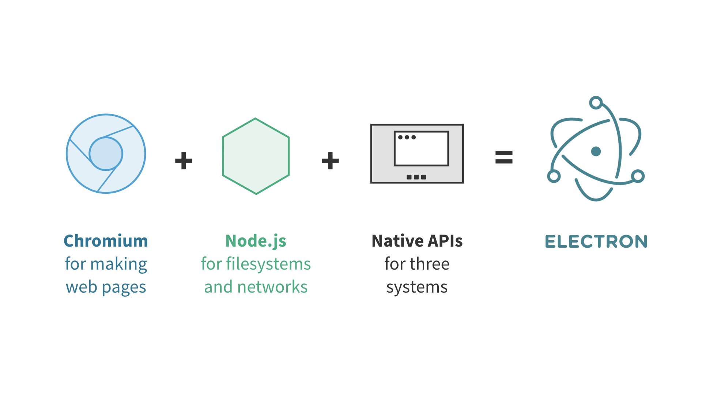
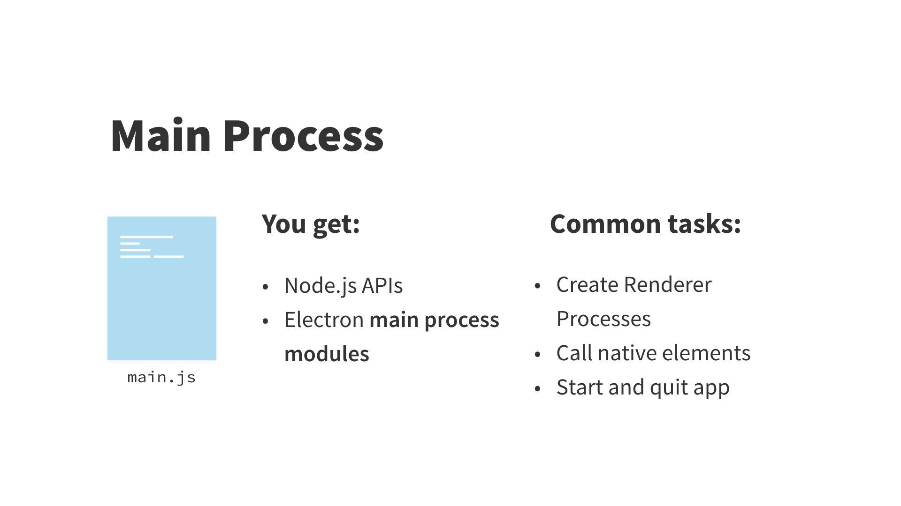
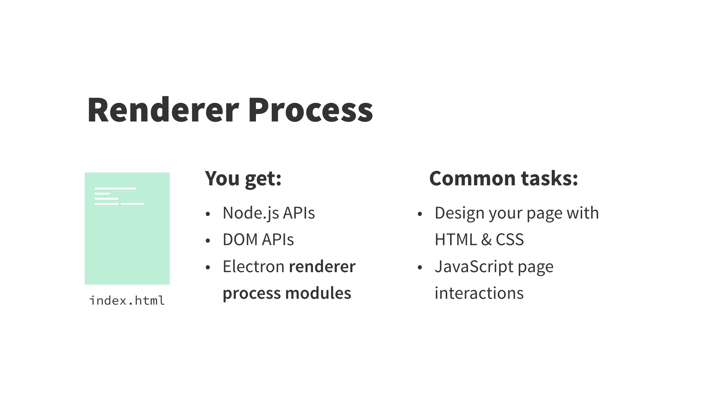
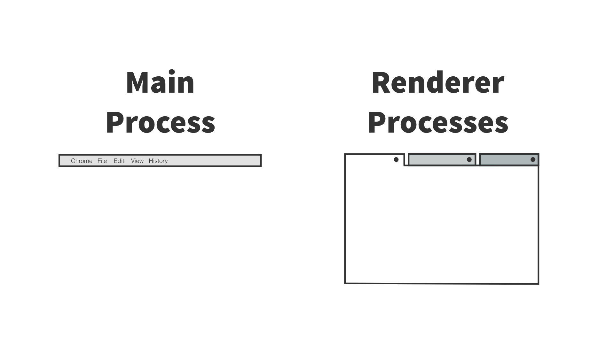
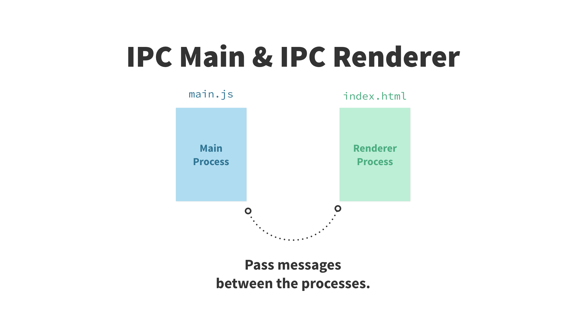
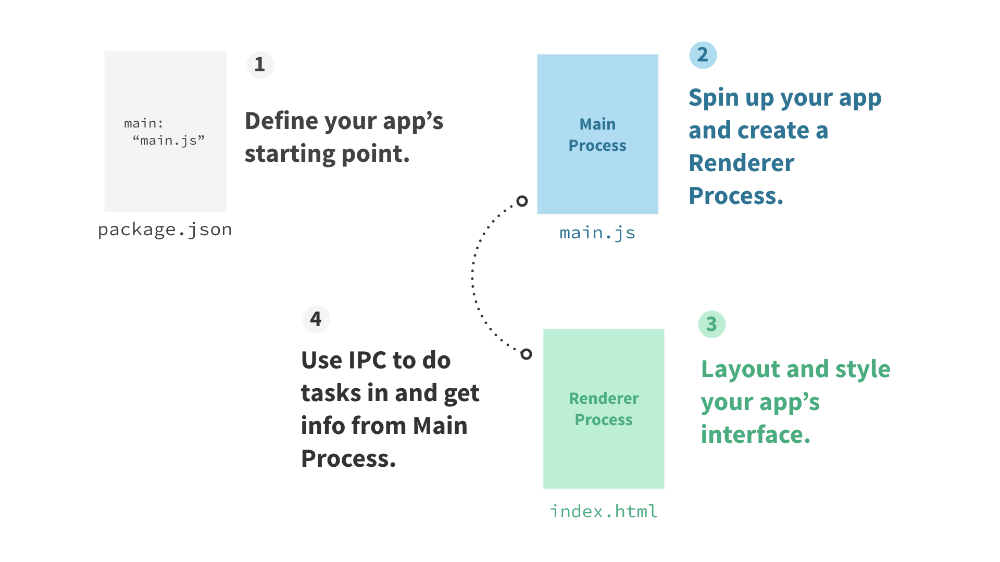

# Essential Electron

Concise plain-speak about Electron.

| Background |
| --- |
| [What is Electron?](#what-is-electron-) |
| [Why is this important?](#why-is-this-important-) |
| [How, even?](#how-even-) |
| [What is developing like?](#what-s-developing-like-) |

| Development |
| --- |
| [Prereqs](#prereqs) |
| [Two Processes](#two-processes) |
| [Main Process](#main-process) |
| [Renderer Process](#renderer-process) |
| [Think of it like this](#think-of-it-like-this) |

| Development Cont'd |
| --- |
| [Stay in touch](#stay-in-touch) |
| [Put it all together](#put-it-all-together) |
| [Quick start](#quick-start) |
| [Packaging](#packaging) |
| [More resources](#more-resources) |

## What is Electron?

Electron is a library you can use to build desktop applications with JavaScript, HTML and CSS. These applications can be packaged to run on Mac, Windows and Linux computers as well as be placed in the Mac and Windows app stores.

### Next: [Why is this important?](#why-is-this-important-)

### Definitions:
- **JavaScript, HTML and CSS** Are web languages, meaning they are the building blocks of websites and browsers like Chrome know how to turn this code into the visual graphics you see.
- **Electron is a library** Electron is code that you can re-use and not have to write yourself. You use it to build your project on top of.

### Resources:
- [Apps built on Electron](http://electron.atom.io/apps)
- [Electron API Demos](http://electron.atom.io/#get-started) (see what you can do with Electron)

## Why is this important?

Typically, desktop applications for each operating system are written in each's native language. That can mean having three teams writing three versions of your app. Electron enables you to write your app once and with web languages.

### Next: [How, even?](#how-even-)

### Definitions:
- **native (operating system) language** These are languages that the major operating systems are (mostly) built with: Mac, Objective C; Linux, C; Windows, C++.

## How, even?

Electron combines Chromium and Node.js with a set of custom APIs for native operating system functions like open file dialogs, notifications, icons and more.

### Next: [What is developing like?](#what-s-developing-like-)

### Definitions:
- **API** Application Program Interface describes the set of functions made available for you to use a library with.
- **Chromium** Created by Google, this is the open source library used by Google's browser Chrome.
- **Node.js** (or Node) A tool for writing JavaScript on servers, accessing filesystems and networks (your computer is also a server!).

### Resources:
- [Node.js](https://nodejs.org)
- [Chromium](http://chromium.org)
- [Electron blog post: Using Node as a Library](http://electron.atom.io/blog/2016/08/08/electron-internals-using-node-as-a-library) (deep dive)
- [Electron versioning](http://electron.atom.io/docs/tutorial/electron-versioning/)

## What's developing like?

Developing with Electron is like building web pages that you can seamlessly use Node in—or building a Node app in which you can build an interface with HTML and CSS. And you only need to design for one browser, the latest Chrome.

### Next: [Prereqs](#prereqs)

### Definitions:
- **Use Node in** That's not all! In additional to the full Node API everywhere, you can make use of the over 300,000 modules already written and hosted on npm, a package manager for Node.
- **One browser** Not all browsers are the same and web designers and developers often have to go the extra mile to make one site look the same on each.
- **Latest Chrome** Use over 90% of ES2015, the latest updates to JavaScript, as well as cool features like CSS Variables.

### Resources:
- [Can I Use?](http://caniuse.com/#home) (see what each browser supports)
- [Updates to Chrome](http://blog.chromium.org) (Chromium Blog)
- [CSS Variables](https://developers.google.com/web/updates/2016/02/css-variables-why-should-you-care?hl=en)

## Prereqs

Since Electron's two components are websites and JavaScript, you'll need experience in both of those before you begin. Check out some tutorials on HTML, CSS and JS and install Node on your computer.

### Definitions:
- **Let's be real**, learning to make websites and write Node are not overnight things but hopefully the links below can get you started.

### Next: [Two Processes](#two-processes)

### Resources:
- [Install Node](https://nodejs.org) (chose the LTS version)
- [NodeSchool Tutorials](http://nodeschool.io) (try learnyounode)
- [JS for Cats](http://jsforcats.com) (by Max Ogden)
- [Learn to Code HTML & CSS](http://learn.shayhowe.com/html-css) (by Shay Howe)
- [CSS Tricks](https://css-tricks.com) (learn CSS best practices and tips)
- [Mozilla Developer Network](https://developers.google.com/web/updates/2016/02/css-variables-why-should-you-care?hl=en) (like a dictionary for websites and JavaScript)

## Two Processes

Electron has two types of processes: Main and Renderer. There are modules that work on each or in both of the processes. The main process is more behind-the-scenes while the renderer process is each of the windows in your app.

### Definitions:
- **Modules** Electron's APIs are grouped together based on what they do. For instance the `dialog` module has all the APIs for native dialogs like open file, save file and alerts.

### Next: [Main Process](#main-process)

### Resources:
- [Electron APIs List](http://electron.atom.io/docs/api/)

## Main Process

The main process, commonly a file named `main.js`, is the entry point to every Electron app. It controls the life of the app, from open to close. It also calls the native elements and creates each new renderer process in the app. The full Node API is built in.

### Definitions:
- **Calls the native elements** Opening dialogs and other native operating system interactions are resource intensive so it's done in the main process, leaving the renderer process uninterrupted.

### Next: [Renderer Process](#renderer-process)

### Resources:
- [Electron APIs List](http://electron.atom.io/docs/api/)

## Renderer Process

The renderer process is a browser window in your app. Unlike the main process, there can be multiple of these and each is independent. They can also be hidden. Usually one is named `index.html`. They're like typical HTML files but in Electron you've got the whole Node API available here, too, unlike any web browser.

### Definitions:
- **Each is independent** every renderer process is a separate process, meaning a crash in one won't affect another.
- **Hidden** You can set a window to be hidden and use it to just execute code in the background.

### Next: [Think of it like this](#think-of-it-like-this)

### Resources:
- [Electron APIs List](http://electron.atom.io/docs/api/)

## Think of it like this

In Chrome (or another web browser) each tab and its web page is like a single renderer process in Electron. If you close all of the tabs, Chrome is still there, this is like your main process, and you can open a new window or quit the app.

### Resources:
- [Differences between Main and Renderer Process](http://electron.atom.io/docs/tutorial/quick-start/#differences-between-main-process-and-renderer-process)

### Next: [Stay in touch](#stay-in-touch)

## Stay in touch

The main and renderer processes need to be able to communicate since they're both responsible for different tasks. For that there's IPC, interprocess communication. Use it to pass messages between main and renderer processes.

### Definitions:
- **IPC** The main process and renderer process each have an IPC module to use.

### Next: [Put it all together](#put-it-all-together)

## Put it all together

Electron apps are like Node apps and use a `package.json` file. It's there that you define which file is your main process and thus where Electron should start your app. Then that main process can create renderer processes and you'll use IPC to pass messages between the two.

### Definitions:
- **`package.json` file** This is a common file in Node apps which contains metadata about the project and a list of dependencies.

### Next: [Quick start](#quick-start)

## Quick start

The Electron Quick Start repository is a bare-bones Electron app with the `package.json`, `main.js` and `index.html` you've learned about here—a great place to get started! Also, check out the boilerplates for templates with your framework of choice.

### Next: [Packaging](#packaging)

### Resources:
- [Electron Quick Start](https://github.com/electron/electron-quick-start)
- [Awesome Electron: Boilerplates](http://electron.atom.io/community#boilerplates)

## Packaging

Once your app is built, you can package it with the command-line tool `electron-packager` for Mac, Windows or Linux. Add scripts for this to your `package.json`. Check out resources below for getting your app in the Mac and Windows app stores.

### Next: [More resources](#more-resources)

### Definitions:
- **command-line tool** This is a program that you interact with by passing commands to it in your terminal.

### Resources:
- [electron-packager](http://github.com/electron-userland/electron-packager)
- [Electron API Demos packaging scripts](https://github.com/electron/electron-api-demos/blob/master/package.json#L15-L18)
- [Mac App Store Electron Guide](http://electron.atom.io/docs/tutorial/mac-app-store-submission-guide/)
- [Windows App Store Electron Guide](http://electron.atom.io/docs/tutorial/windows-store-guide/)

## More resources

The concepts here will get you pretty far, but there is of course more so here are other resources.

### Resources:
- [Full Electron docs](http://electron.atom.io/docs/)
- [Awesome Electron: tools, videos, components, meetups](http://electron.atom.io/community/)
- [Spectron](http://electron.atom.io/spectron/) (Electron testing library)
- [Devtron](http://electron.atom.io/devtron/) (Inspect your Electron app)
