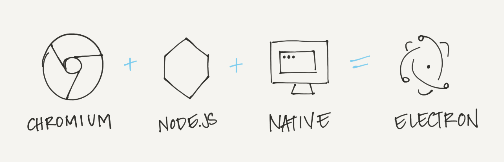

# Essential Electron

Concise plain-speak about Electron.

| Background | Development |
| --- | --- |
| [What is Electron?](#what-is-electron-) | [How do I start?](#how-do-i-start-) |
| [Why is this important?](#why-is-this-important-) | [Electron's Two Processes](#electron-s-two-processes) |
| [How, even?](#how-even-) | [Main Process](#how-do-i-start-) |
| [What is developing like?](#what-is-developing-like-) | [Renderer Process](#how-do-i-start-) |
| [WHAT GOES HERE](#what-is-developing-like-) | [Put it together](#how-do-i-start-) |

## What is Electron?

Electron is a library you can use to build desktop applications with JavaScript, HTML and CSS. These applications can be packaged to run on Mac, Windows and Linux computers as well as be placed in the Mac and Windows app stores.

### Next: [Why is this important?](#why-is-this-important-)

### Definitions:
- **JavaScript, HTML and CSS** Are web languages, meaning they are the building blocks of websites and browsers like Chrome know how to turn this code into the visual graphics you see.
- **Electron is a library** Electron is code that you can re-use and not have to write yourself. You use it to build your project on top of.

### Resources:
- [Apps built on Electron](http://electron.atom.io/apps)

## Why is this important?

Typically, desktop applications for each operating system are written in each's native language. That can mean having three teams writing three versions of your app. Electron enables you to write your app once and with web languages.

### Next: [How, even?](#how-even-)

### Definitions:
- **native (operating system) language** These are languages that the major operating systems are (mostly) built with: Mac, Objective C; Linux, C; Windows, C++.

## How, even?

Electron combines Chromium and Node.js with a set of custom APIs for native operating system functions like open file dialogs, notifications, icons and more.

### Next: [What is developing like?](#what-s-developing-like-)

### Definitions:
- **API** Application Program Interface describes the set of methods made available for you to use a library with.
- **Chromium** Created by Google, this is the open source library used by Google's Chrome browser.
- **Node.js** (or Node) A tool for writing JavaScript on servers, accessing filesystems and networks (your computer is also a server!).
- **V8** Chrome and Node.js use V8, an engine that translates JavaScript into the code that can run directly on the computer.

### Resources:
- [Node.js](https://nodejs.org)
- [Chromium](http://chromium.org)
- [Electron blog post: Using Node as a Library](http://electron.atom.io/blog/2016/08/08/electron-internals-using-node-as-a-library) (deep dive)

## What's developing like?

Developing with Electron is like building web pages that you can seamlessly use Node in—or building a Node app in which you can build an interface with HTML and CSS. And you only need to design for one browser, the latest Chrome.

### Next: [How do I start?](#how-do-i-start-)

### Definitions:
- **One browser** Not all browsers are the same and web designers and developers often have to go the extra mile to make one site look the same on each.
- **Latest Chrome** Use over 90% of ES2015, the latest updates to JavaScript, as well as cool features like CSS Variables.

### Resources:
- [Can I Use?](http://caniuse.com/#home) (see what each browser supports)
- [Updates to Chrome](http://blog.chromium.org) (Chromium Blog)
- [CSS Variables](https://developers.google.com/web/updates/2016/02/css-variables-why-should-you-care?hl=en)

## How do I start?

Since Electron's two components are websites and Node you'll need experience in both of those before you begin. Check out some tutorials on HTML, CSS and JS and install Node on your computer.

### Definitions:
- **Let's be real**, learning to make websites and write Node are not overnight things but hopefully the links below can get you started.

### Next: [Electron's Two Processes](#electron-s-two-processes)

### Resources:
- [Install Node](https://nodejs.org) (chose the LTS version)
- [NodeSchool Tutorials](http://nodeschool.io) (try learnyounode)
- [JS for Cats](http://jsforcats.com)
- [Learn to Code HTML & CSS](http://learn.shayhowe.com/html-css) (by Shay Howe)
- [CSS Tricks](https://css-tricks.com)
- [Mozilla Developer Network](https://developers.google.com/web/updates/2016/02/css-variables-why-should-you-care?hl=en)

## Electron's Two Processes

Electron has two processes: Main and Renderer. There are modules that work on both and some that only work on one of the two.

### Definitions:
- **Modules** Electron's APIs are grouped together in modules based on what they do. For instance the `dialog` module has all the APIs for native dialogs like open file, save file and alerts.

### Next: [Main Process](#main-process)

### Resources:
- [Electron APIs List](http://electron.atom.io/docs/api/)

## Main Process

Electron has two processes: Main and Renderer. There are modules that work on both and some that only work on one of the two.

### Definitions:
- **Modules** Electron's APIs are grouped together in modules based on what they do. For instance the `dialog` module has all the APIs for native dialogs like open file, save file and alerts.

### Next: [Main Process](#main-process)

### Resources:
- [Electron APIs List](http://electron.atom.io/docs/api/)
